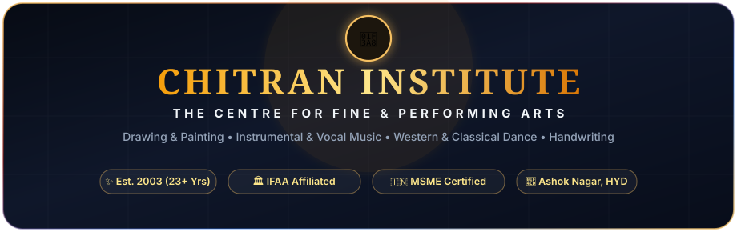

<div align="center">

  <!-- Hero Banner SVG -->
  

  <br><br>

  <!-- Animated Typing Headline -->
  <a href="https://vikram30069.github.io/chitraninstitute/">
    
  </a>

  <br><br>

  <!-- Live Deployment & Repository Badges -->
  <p align="center">
    <a href="https://vikram30069.github.io/chitraninstitute/">
      
    </a>
    <a href="https://chitraninstitute.com">
      
    </a>
    <a href="https://github.com/Vikram30069/chitraninstitute/stargazers">
      
    </a>
    <a href="https://github.com/Vikram30069/chitraninstitute/network/members">
      
    </a>
    <a href="https://github.com/Vikram30069/chitraninstitute/blob/main/LICENSE">
      
    </a>
  </p>

  <!-- Tech Stack Badges -->
  <p align="center">
    
    
    
    
    
    
    
  </p>

</div>

---

## 🏛️ Executive Summary

**Chitran Institute** has been an artistic beacon in Ashok Nagar, Hyderabad since **2003**, nurturing thousands of students under the personal mentorship of national and international award-winning master **Guru Rajkumar Banerjee (Suryachandra Awardee)**. 

This repository houses the modern, high-converting digital platform built with cinematic Aarabhi-inspired aesthetics, interactive course filtering, predictive search autocomplete, full multi-discipline mega menus, and an interactive WhatsApp admissions modal.

```
       ┌────────────────────────────────────────────────────────┐
       │             CHITRAN DIGITAL ECOSYSTEM                  │
       └──────────────────────────┬─────────────────────────────┘
                                  │
         ┌────────────────────────┼────────────────────────┐
         │                        │                        │
         ▼                        ▼                        ▼
 🔍 Sticky Quick Search   🏛️ Equal Mega Menus   🎯 3-Way Dynamic Filter
   Predictive Autocomplete   Drawing • Music • Dance   Age • Interest • Goal
         │                        │                        │
         └────────────────────────┼────────────────────────┘
                                  │
                                  ▼
                     💬 Interactive WhatsApp FAB
                     Personalized Admissions Modal
```

---

## ⚡ Key Highlights & Innovations

<table>
  <tr>
    <td width="50%">
      <h3>🔍 1. Predictive Quick Course Search</h3>
      <ul>
        <li>Sticky navigation search input with real-time course index.</li>
        <li>Predictive autocomplete suggests courses as you type (e.g. <i>"Key..."</i> &rarr; <i>"Keyboard & Piano"</i>).</li>
        <li>Full keyboard accessibility (<code>ArrowUp</code>, <code>ArrowDown</code>, <code>Enter</code>, <code>Escape</code>).</li>
        <li>Direct scroll-to-card navigation on suggestion selection.</li>
      </ul>
    </td>
    <td width="50%">
      <h3>🏛️ 2. Multi-Discipline Mega Menus</h3>
      <ul>
        <li>Restored equal visual hierarchy for <b>Music</b> and <b>Dance</b> alongside <b>Drawing</b>.</li>
        <li><b>Drawing:</b> 8 fine art mediums (Canvas Oil, Tanjore 22K Gold, Watercolors, Acrylic, Knife 3D, etc.).</li>
        <li><b>Music:</b> 6 academy syllabi (Trinity College Keyboard, Guitar, Carnatic/Hindustani Vocals, Violin, Drums).</li>
        <li><b>Dance:</b> 6 disciplines (Hip-Hop, Bollywood, Contemporary, Classical Mudras, Junior Troupe).</li>
      </ul>
    </td>
  </tr>
  <tr>
    <td width="50%">
      <h3>🎯 3. Interactive 3-Way Course Filter</h3>
      <ul>
        <li>Dynamic dropdown filter placed directly above course cards:
          <ul>
            <li><b>Age Group:</b> Kids (4-12), Teens (13-17), Adults (18+).</li>
            <li><b>Interest:</b> Drawing, Music, Dance, Handwriting.</li>
            <li><b>Goal:</b> Creative Passion / Hobby, Trinity / IFAA Certification.</li>
          </ul>
        </li>
        <li>Dynamic live preview button counter: <code>Show X Courses</code>.</li>
        <li>Instant DOM filtering with zero page reload latency.</li>
      </ul>
    </td>
    <td width="50%">
      <h3>💬 4. Consolidated WhatsApp FAB & Modal</h3>
      <ul>
        <li>Removed repetitive buttons across menus and header.</li>
        <li>Single pulsing floating action button (FAB) at bottom-right.</li>
        <li>Opens interactive course & age selection modal.</li>
        <li>Auto-generates clean, pre-filled WhatsApp inquiry with encoded parameters (<code>%26</code> safe).</li>
      </ul>
    </td>
  </tr>
</table>

---

## 📱 Mobile Architecture & Zero-Overflow Audit

The platform was tested and validated across **8 distinct mobile and tablet viewports** using automated Chrome DevTools Protocol (CDP) headless telemetry:

| Device Viewport | Dimensions | Scroll Width | Inner Width | Status | Horizontal Overflow |
|:---|:---:|:---:|:---:|:---:|:---:|
| **iPhone SE (1st gen)** | `320 x 568` | `320px` | `320px` | `PASS` ✅ | **0px** |
| **Samsung Galaxy S8** | `360 x 740` | `360px` | `360px` | `PASS` ✅ | **0px** |
| **iPhone 8 / SE 2** | `375 x 667` | `375px` | `375px` | `PASS` ✅ | **0px** |
| **iPhone 12 / 13 / 14** | `390 x 844` | `390px` | `390px` | `PASS` ✅ | **0px** |
| **Pixel 7 / Android** | `412 x 915` | `412px` | `412px` | `PASS` ✅ | **0px** |
| **iPad Mini (Portrait)** | `768 x 1024` | `768px` | `768px` | `PASS` ✅ | **0px** |
| **iPad Pro / Laptop** | `1024 x 768` | `1009px` | `1024px` | `PASS` ✅ | **0px** |
| **Desktop Standard** | `1280 x 800` | `1265px` | `1280px` | `PASS` ✅ | **0px** |

---

## 🎨 Course Curriculum Matrix

| Discipline | Core Mediums / Instruments | Syllabus & Pedagogy | Age Groups | Certification |
|:---|:---|:---|:---:|:---:|
| ✏️ **Fine Arts** | Oil Realism, Watercolor, Acrylic, Tanjore 22K Gold, 3D Knife | Classical underpainting, glazing & composition | 4+ to Adults | IFAA Certified |
| 🎹 **Music Academy** | Piano/Keyboard, Acoustic/Electric Guitar, Classical Vocals | Trinity College London & Classical Ragas | 5+ to Adults | Trinity London Grades |
| 💃 **Dance Studio** | Hip-Hop, Bollywood Commercial, Contemporary, Classical | Urban popping/breaking, mudras, stage sync | 4+ to Adults | State / Annual Honors |
| ✍️ **Handwriting** | English Cursive, Print, Speed & Scientific Grip Correction | 1-Month intensive motor skill overhaul | 6+ to Adults | Academy Certificate |

---

## 📂 Repository Anatomy

```text
chitraninstitute/
├── 🌐 index.html                       # Root GitHub Pages redirect gateway
├── 📁 preview/                         # Production-ready web application
│   ├── index.html                     # Core Homepage with Slider, Filter & Modals
│   ├── drawing.html                   # Fine Arts & Painting academy portal
│   ├── music.html                     # Instrumental & Vocal music academy portal
│   ├── dance.html                     # Western & Classical dance academy portal
│   ├── handwriting.html               # 1-Month handwriting scientific overhaul
│   ├── achievements.html              # Student honours, press & trophies gallery
│   ├── summercamp.html                # Annual Summer creative bootcamps
│   ├── events.html                    # Exhibitions & stage performances
│   ├── location.html                  # Campus directions, map & inquiry
│   ├── styles.css                     # Unified design system & responsive layout
│   ├── app.js                         # Search, dynamic filter & modal controller
│   └── assets/                        # High-resolution optimized visual assets
├── 📁 content/                         # Landing page copy & curriculum outlines
├── 📁 docs/                            # Architecture guides & documentation
│   └── assets/                        # Badges, diagrams & animated banners
├── 📁 schema/                          # JSON-LD Schema.org SEO structured data
│   ├── course_schemas.json            # Course microdata schemas
│   ├── local_business_schema.json     # LocalBusiness geocoded schema
│   └── faq_schema.json                # High-intent search FAQ microdata
├── 📁 seo-blueprint/                   # Master SEO keyword matrices & redirects
│   ├── master_seo_matrix.csv          # Keyword hierarchy & target density
│   └── url_redirect_map.csv           # 301 redirection blueprint
├── 📁 templates/                       # Elementor / WordPress JSON templates
├── .gitignore                         # Clean git exclusion rules
└── README.md                          # Interactive documentation
```

---

## 🛠️ Technology Stack & Engineering Standards

- **Semantic HTML5:** Full ARIA compliance, semantic headings, schema microdata tags.
- **Modern CSS3:** Custom HSL variables, fluid typography, Flexbox, CSS Grid, backdrop-filter glassmorphism, responsive media queries.
- **Vanilla ES6+ JavaScript:** Zero-dependency footprint, sub-millisecond autocomplete index search, DOM event delegation, URLSearchParams handling.
- **Cache-Busting & Telemetry:** Version-stamped query parameters (`?v=2.2`), strict HTTP cache-control headers, automated CDP verification scripts.

---

## 💻 Quick Start & Local Preview

Clone and run the application locally in seconds:

```bash
# 1. Clone the repository
git clone https://github.com/Vikram30069/chitraninstitute.git

# 2. Enter project directory
cd chitraninstitute/preview

# 3. Start a local server using Python 3
python -m http.server 8085
```

Navigate to:  
👉 **`http://localhost:8085/index.html`**

---

<details>
<summary><b>🔍 View JSON-LD Schema.org Architecture (Click to expand)</b></summary>
<br>

```json
{
  "@context": "https://schema.org",
  "@type": "EducationalOrganization",
  "name": "Chitran Institute - The Centre for Fine & Performing Arts",
  "founder": {
    "@type": "Person",
    "name": "Guru Rajkumar Banerjee",
    "award": "Suryachandra Award"
  },
  "foundingDate": "2003",
  "telephone": "+919866150378",
  "email": "chitrandsp@gmail.com",
  "address": {
    "@type": "PostalAddress",
    "streetAddress": "Ashok Nagar",
    "addressLocality": "Hyderabad",
    "addressRegion": "Telangana",
    "addressCountry": "IN"
  },
  "hasOfferCatalog": {
    "@type": "OfferCatalog",
    "name": "Academy Programs",
    "itemListElement": [
      { "@type": "Course", "name": "Fine Arts, Drawing & Canvas Oil Painting" },
      { "@type": "Course", "name": "Keyboard & Piano (Trinity College London)" },
      { "@type": "Course", "name": "Acoustic & Electric Guitar" },
      { "@type": "Course", "name": "Carnatic & Hindustani Vocal Music" },
      { "@type": "Course", "name": "Western & Classical Dance (Hip-Hop & Mudras)" },
      { "@type": "Course", "name": "Scientific Handwriting Improvement" }
    ]
  }
}
```

</details>

---

<div align="center">

  ### 🏆 Built with Pride by [Vikram B (Vikram30069)](https://github.com/Vikram30069)
  *Engineering High-Performance Web Architectures, Intuitive Interfaces & Conversion-Driven User Experiences.*

  <br>

  <a href="https://github.com/Vikram30069">
    
  </a>
  <a href="https://vikram30069.github.io/chitraninstitute/">
    
  </a>

  <br><br>

  <sub>&copy; 2026 Chitran Institute. All Rights Reserved. Affiliated to Indian Fine Art Association (IFAA) & MSME Certified.</sub>

</div>
