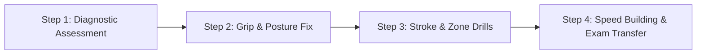

# Handwriting Improvement, Calligraphy & Abacus Classes in Hyderabad

**Target URL**: `/handwriting-classes-hyderabad/` (and child pages `/handwriting-improvement-classes-hyderabad/`, `/calligraphy-classes-hyderabad/`, `/abacus-classes-hyderabad/`, `/speed-maths-classes-hyderabad/`)  
**Meta Title**: Handwriting Improvement & Abacus Classes Hyderabad | Chitran Institute  
**Meta Description**: Improve handwriting neatness and speed in English & Hindi. Master Calligraphy, Abacus & Speed Maths in Ashok Nagar, Hyderabad. Guaranteed results!  
**Target Keywords**: handwriting classes in hyderabad, handwriting improvement classes near me, english handwriting course, hindi handwriting classes hyderabad, calligraphy classes hyderabad, abacus classes hyderabad, speed maths  

---

## 1. Hero Section

### Pre-Heading
✍️ **Academic Skill Development & Cognitive Enhancement Academy**

### H1 Headline
# Transform Handwriting Neatness, Speed & Cognitive Focus in Hyderabad

### Subtitle
Poor handwriting and slow writing speed can severely impact a student’s academic grades, confidence, and exam performance. At Chitran Institute, our **scientific handwriting remediation, artistic calligraphy, abacus, and speed maths programs** empower students with clear penmanship and rapid mental calculation abilities.

### Key Highlights
- 📝 **Guaranteed Transformation** in 15–30 Session Modules
- ✍️ **English (Print & Cursive) + Hindi (Devanagari)** Script Training
- 🧠 **8-Level Soroban Abacus** for 10x Mental Calculation Speed
- 📍 **Central Ashok Nagar / Himayatnagar Campus** in Hyderabad

### CTA Buttons
- `[ Book a Free Handwriting Assessment Test ]`
- `[ View Program Details & Batch Timings ]`

---

## 2. Academic Programs Offered

### A. English Handwriting Improvement (Print & Cursive)
- **Problem Solved**: Illegible handwriting, inconsistent letter heights, incorrect slant, improper letter spacing, and slow writing during timed exams.
- **Methodology**: 
  1. Ergonomic posture & tripod pencil grip correction.
  2. Four-line paper letter zone calibration (Upper, Middle, Lower loops).
  3. Proper spacing between words and sentence alignment.
  4. Speed building drills without sacrificing clarity.
- **Target Audience**: School students (Class 1 to 12), college students, competitive exam candidates, and adults.
- **Dedicated Page Link**: `[ Learn More about Handwriting Classes → ]` (`/handwriting-improvement-classes-hyderabad/`)

### B. Hindi Handwriting Improvement (Devanagari Script)
- **Focus**: Shirorekha (top line) straightness, matra placement, letter proportions, and uniform baseline alignment.
- **Dedicated Page Link**: `[ Learn More about Hindi Handwriting → ]` (`/handwriting-improvement-classes-hyderabad/`)

### C. Artistic Calligraphy & Lettering Classes
- **Techniques**: Broad-edge nib calligraphy, Copperplate, Gothic/Blackletter, modern brush lettering, decorative borders, certificate writing, and creative journaling.
- **Dedicated Page Link**: `[ Learn More about Calligraphy → ]` (`/calligraphy-classes-hyderabad/`)

### D. Abacus Mental Arithmetic (Ages 5 to 13)
- **Focus**: Whole-brain development using the Japanese Soroban Abacus. Boosts visual memory, mental concentration, spatial orientation, and lightning-fast mental addition, subtraction, multiplication, and division.
- **Dedicated Page Link**: `[ Learn More about Abacus Classes → ]` (`/abacus-classes-hyderabad/`)

### E. Speed Maths & Vedic Mathematics (Ages 12+ & High School)
- **Focus**: Vedic arithmetic sutras, mental cross-multiplication shortcuts, square roots, cube roots, and algebraic simplifications for Board Exams & Olympiads.
- **Dedicated Page Link**: `[ Learn More about Speed Maths → ]` (`/speed-maths-classes-hyderabad/`)

---

## 3. The 4-Step Handwriting Transformation Process

1. **Diagnostic Assessment**: We evaluate current writing samples for speed (words per minute), letter formation, pressure, and alignment flaws.
2. **Grip & Posture Correction**: Eliminating finger fatigue and wrist pain by teaching the relaxed dynamic tripod grip.
3. **Stroke & Zone Drills**: Repetitive muscle memory exercises on line control, oval rotations, loop closures, and uniform slant.
4. **Speed & Exam Transfer**: Transitioning neat handwriting onto unruled answer sheets under strict timed test conditions.

---

## 4. Frequently Asked Questions (FAQ)

#### How many days does the handwriting improvement course take?
Most students see a dramatic transformation within 15 to 30 guided sessions. We offer both intensive crash courses (during vacations) and regular weekly batches.

#### Is this program suitable for students taking Board Exams (10th & 12th)?
Yes! In Board Exams, clean presentation and speed are critical. Our specialized exam-oriented modules ensure high legibility and quick writing so students finish papers on time.

#### Can adults join calligraphy and handwriting classes?
Absolutely. We train college students, teachers, and professionals looking to enhance their daily penmanship or pursue calligraphy as an artistic profession.

---

## 5. Contact & Free Handwriting Analysis

**Location**: Chitran Institute, Street Number 10, P & T Colony, Ashok Nagar, Himayatnagar, Hyderabad 500020  
**Direct Line**: +91 9866150378 / +91 9291565318  
`[ Call Now ]` `[ WhatsApp for Free Sample Assessment ]`
