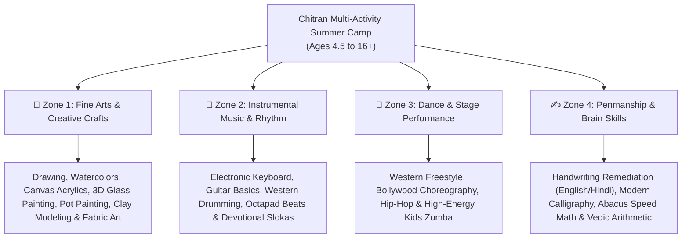

# Summer Camp & Creative Workshops in Hyderabad – Chitran Institute

**Target URL**: `/summer-camp-workshops/`  
**Meta Title (58 chars)**: Summer Camp in Hyderabad 2026 | Chitran Institute Ashok Nagar  
**Meta Description (154 chars)**: Join Hyderabad's premier multi-activity summer camp for kids & teens. Drawing, painting, keyboard, guitar, drums, dance, handwriting & abacus. Register now!  
**Target Keywords**: summer camp in hyderabad, kids summer camp hyderabad, art summer camp ashok nagar, music and dance summer camp hyderabad, summer activities for kids hyderabad  

---

## 1. Hero Section

### Pre-Headline Badge
☀️ **Hyderabad’s Most Popular Multi-Activity Summer Camp | Est. 2003 | Ashok Nagar**

### H1 Headline
# Creative & Skill-Building Summer Camp in Hyderabad for Kids & Teens

### Sub-Headline
Give your child a vibrant, screen-free summer filled with artistic discovery, musical rhythm, energetic dance, and cognitive skill building. Chitran Institute’s annual Summer Camp brings together over **15+ hands-on activities** under expert guidance in a fun, safe, and nurturing environment.

### Quick Camp Highlights
- 🎨 **Art, Music, Dance & Academics** Under One Roof
- 📅 **Flexible 2-Week, 4-Week & Weekend Camp Batches**
- 🏆 **Grand Art Exhibition & Stage Showcase for Parents**
- 📜 **Official Certificate of Participation for Every Child**
- 📍 **Central Campus**: Ashok Nagar / Himayatnagar, Hyderabad

### Call to Action (CTA) Buttons
- `[ Download Summer Camp Schedule & Fee Brochure ]`
- `[ WhatsApp for Early-Bird Registration ]`

---

## 2. Four Multi-Activity Camp Zones

Inspired by top academies like *Talent Hub* and *Siri Painting*, our camp is organized into 4 engaging experiential zones:

---

## 3. Detailed Camp Modules

### Zone 1: Fine Arts & Handcrafted Masterpieces
- **Canvas Acrylic & Palette Knife Painting**: Create vibrant, frame-worthy landscape and abstract canvas paintings.
- **3D Glass & Ceramic Pot Painting**: Learn stained-glass relief techniques and decorative terracotta pot embossing.
- **Clay Modeling & Sculpture**: Develop tactile 3D spatial awareness and hand-eye coordination.
- **Batik & Fabric Painting**: Creative textile painting and freehand motifs on bags/fabrics.
- **Sketching & Cartooning**: Line drawing, character illustration, and comic sketching.

### Zone 2: Instrumental Music & Rhythm Fun
- **Keyboard / Piano Foundations**: Learn to play popular children's melodies, chords, and staff notation basics.
- **Guitar Strumming & Chords**: Basic fretboard finger placement, open chords, and rhythm strumming.
- **Drum Beats & Octapad**: Master meter, metronome timing, and energetic percussion grooves.
- **Vocal Singing & Sanskrit Slokas**: Pure voice projection, classical notes, and traditional sloka recitation.

### Zone 3: Dance & Movement Academy
- **Bollywood & Western Choreography**: Step-by-step dance routines set to popular upbeat tracks.
- **Hip-Hop Grooves**: Footwork, body isolations, rhythm flow, and stage confidence.
- **Zumba Fitness**: Fun cardiovascular fitness designed specifically for kids.

### Zone 4: Penmanship & Cognitive Boosters
- **Handwriting Transformation**: Scientific remediation for neatness, pencil grip, posture, and speed.
- **Artistic Calligraphy**: Brush pen lettering, Gothic strokes, and decorative card crafting.
- **Abacus & Speed Maths**: Brain gym exercises, Soroban bead visualization, and lightning-fast mental math.

---

## 4. Age-Categorized Camp Batches

| Batch Level | Age Group | Timings | Core Experience |
| :--- | :--- | :--- | :--- |
| **Junior Explorers** | 4.5 to 7 Years | 9:30 AM – 12:30 PM | Grip correction, oil pastels, clay modeling, slokas, keyboard fun & junior dance |
| **Rising Creators** | 8 to 12 Years | 10:00 AM – 1:00 PM | Watercolor, canvas acrylic, 3D glass art, guitar, drums, calligraphy & handwriting |
| **Teen Innovators** | 13 to 17 Years | 2:00 PM – 5:00 PM | Advanced canvas oil/acrylics, Tanjore basics, lead keyboard, Vedic math & stage dance |
| **Weekend Intensive** | All Ages | Sat & Sun (Morning/Evening) | Fast-track crash workshops in specialized art forms, instruments & calligraphy |

---

## 5. Why Parents Love Chitran Summer Camp

1. **All-Inclusive Experiential Learning**: Children explore multiple passions instead of being locked into a single activity.
2. **Safe & Air-Conditioned Campus**: Centrally located in Ashok Nagar with clean, spacious studios and round-the-clock safety.
3. **Grand Finale Exhibition & Recital**: Parents are invited on the final day to view the student art gallery and watch live music and dance performances!
4. **All Material Kits Provided**: Every student receives a high-quality creative art and activity kit upon joining.

---

## 6. Real Parent Feedback

> *"Chitran Institute's summer camp was the best decision for our children. In 4 weeks, they learned keyboard basics, created beautiful glass paintings, and their handwriting became noticeably neater. The teachers are so caring and patient!"*  
> — **Parent of 2 Campers, Himayatnagar, Hyderabad**

---

## 7. Frequently Asked Questions (FAQ)

#### Do I need to buy art materials or instruments separately?
No, standard workshop art materials are supplied in the camp kit. Keyboards, drum kits, and studio instruments are provided on campus during practice sessions.

#### Can we choose specific activities or does my child have to do everything?
We offer both **All-Rounder Combo Packages** (Art + Music + Dance + Skills) as well as **Specialized Single-Faculty Tracks** (e.g., Only Fine Arts or Only Keyboard & Guitar).

#### How do I reserve an early-bird slot?
Call our camp desk at **+91 9866150378 / +91 9291565318** or click the WhatsApp button to reserve your child's batch. Seats are strictly limited to maintain small group attention.

---

## 8. Registration & Contact Hook

- **Camp Venue**: Chitran Institute, Street Number 10, P & T Colony, Ashok Nagar, Himayatnagar, Hyderabad 500020
- **Direct Desk**: +91 9866150378 / +91 9291565318
- **WhatsApp**: Instant Chat via Joinchat
- `[ Register for Summer Camp 2026 ]` `[ WhatsApp Chat ]`
